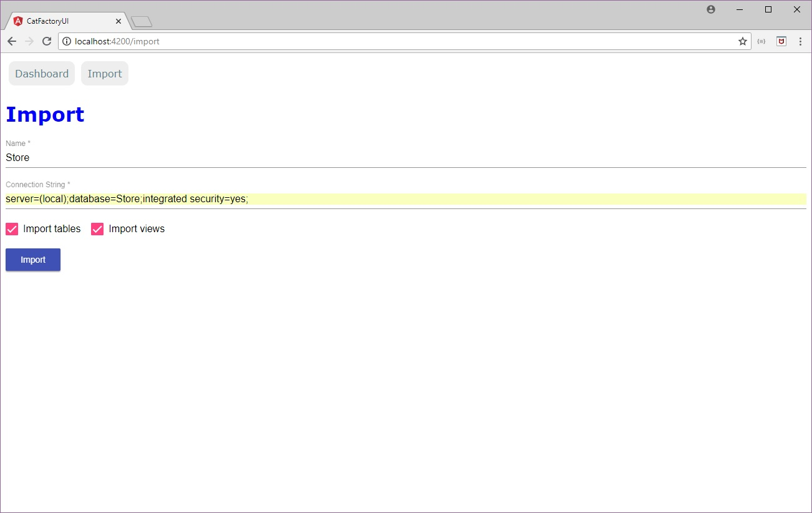

# CatFactory.UI

**CatFactory UI** is the GUI for *CatFactory*.

## Instructions

### Back-end

Prerequisites: *.NET Core 2.2*

#### Visual Studio

1. Open CatFactory.UI.API.sln solution file located in Back-end directory
2. Set CatFactory.UI.API as startup project
3. Rebuild solution
4. Set port number to 8400 in launchSettings.json file (for iisSettings and CatFactory.UI.API profiles)
5. Run CatFactory.UI.API project

**Make sure API runs in port number 8400**

#### Command Line

1. Open a command line terminal for CatFactory.UI.API directory located in Back-end directory
2. Run "dotnet restore" command to restore all nuget packages
3. Run "dotnet run" command to run CatFactory.UI.API project

### Front-end

Prerequisites: *NodeJS*, *Angular CLI*

1. Open a command line for CatFactoryUI directory located in Front-end directory
2. Run "npm install" command to install all nodejs packages
3. Run "ng serve" to start project in port number 4200

## How It Works

Basically GUI works in the same way that **CatFactory.SqlServer** package, We need to import an existing database from SQL Server instance in order to add comments for Database objects.

You can read more about this in [Document SQL Server Databases with CatFactory.UI](https://www.codeproject.com/Articles/1252491/Document-SQL-Server-Databases-with-CatFactory-UI).

### Dashboard

This view show all imported databases:

### Import

This view allows to import an existing database:

Set values for database name and connnection string:

Click import button to complete import process.

### Dashboard With Databases

Once we have import a database, Dashboard view shows the imported database:

### Database Details

We can select a database from dashboard to see database's details:

### Table Details

Inside of database details we can select a row to see table's details:

### Edit Table Description

We can edit description for table:

Set description for table:

### Columns Descriptions

In table details, we can see all descriptions for table columns:

### Edit Table Columns

We can edit description for column:

Set description for column:

